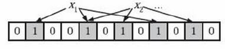
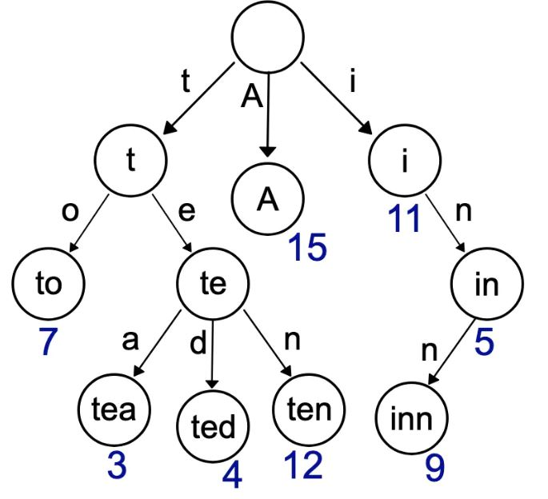
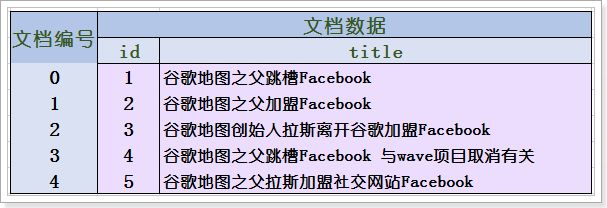

# 大数据问题求解

## 1.基本思路

- 内存不够，用磁盘
- 分桶化大为小
- 位标记判重
- 利用堆找top k
- 注意数据格式及范围

## 2.常用方法

- Hash分桶
- 堆
- Bitmap
- Bloomfilter
- Trie树
- 倒排索引

### 2.1 Hash分桶 && 堆
> 样例1：给⼀个超过100G⼤小的log file, log中存着IP地址，找到出现次数最多的IP地址 <br/>
- 常规方法-HashMap(内存够用)
```aidl
1.使用HashMap数每个IP;
2.时间复杂度：O(N * read)
3.空间复杂度：O(不同IP数)
```
- Hash分桶(内存不够用,假设100M)
```aidl
Map-Reduce思想
1.确定文件切分份数，n = 文件大小 / 内存大小 = 1000；
2.遍历所有IP,将IP映射到不同的子文件中，file_id = hash(IP) % 1000;
3.分别加载每个子文件到内存，统计得到每个子文件最高频IP;
4.合并子文件的最高频IP;
5.时间复杂度：O(2*N*read + N*write)
6.空间复杂度：O(不同IP数/1000)
```
>样例2：给⼀个超过100G⼤小的log file, log中存着IP地址，找到出现次数topk的IP地址 <br/>
- 骚操作
```aidl
linux内置命令 ： sort log_file | uniq -c | head k
```
- HashMap + 小顶堆 (内存够用)
```aidl
1.使用HashMap记录每个IP的次数；
2.初始化大小为k的数组,并将前k个IP存储到数组；
3.基于数组构建小顶堆；
4.遍历剩余的IP，如果当前IP出现次数大于堆顶IP,则替换堆顶IP,重新构建小顶堆；
5.最终数组存的IP即为topk;
6.时间复杂度：O(N * read + 不同IP个数 * logk)
7.空间复杂度：O(不同IP数)
```
- Hash分桶 + 小顶堆 (内存不够用)
```aidl
1.将IP通过hash函数映射到不同子文件；
2.每个子文件进行统计topk；
3.汇总每个子文件topk结果；
```
> 样例3：中位数维护,新增数据不用对数据进行重排序，直接从堆顶取 <br/>
- 大顶堆 + 小顶堆
```aidl
1.现有数据（已排序）一分为二；
2.前半部分存进大顶堆h1，堆顶元素为a;
3.后半部分存进小顶堆h2；
4.对于新来的数据c，如果c > a,那么直接将c插入h2;否则，将h1堆顶元素放入h2，并将c放入h1；
5.每次只用根据元素个数从h1或h2取堆顶元素即可；
```
> 样例4：5亿个整数，找出不重复的个数 <br/>
```aidl
思路一样，分内存够用和不够用情况
```

### 2.2 Bitmap
1. 正常存储一个整数需要4个byte，32bit; <br/>
2. 如果用二进制表示整数的存储，1表示出现，0表示未出现，那么1个byte可以表示8个数; <br/>
3. 通过建立一个字节数组byte[]可以表示更多的数; <br>
4. 例：[1,2,4,6,11] 可以表示为 <br/>
        byte[0] : 0 1 1 0 1 0 1 0 <br/>
        byte[1] : 0 0 1 0 0 0 0 0 
        
5. 实现代码
```aidl
package com.chs.alg.bitmap;

public class BitMap {
    //保存数据的
    private byte[] bits;
    
    //能够存储多少数据
    private int capacity;
    
    
    public BitMap(int capacity){
        this.capacity = capacity;
        
        //1bit能存储8个数据，那么capacity数据需要多少个bit呢，capacity/8+1,右移3位相当于除以8
        bits = new byte[(capacity >>3 )+1];
    }
    
    public void add(int num){
        // num/8得到byte[]的index
        int arrayIndex = num >> 3; 
        
        // num%8得到在byte[index]的位置
        int position = num & 0x07; 
        
        //将1左移position后，那个位置自然就是1，然后和以前的数据做|，这样，那个位置就替换成1了。
        bits[arrayIndex] |= 1 << position; 
    }
    
    public boolean contain(int num){
        // num/8得到byte[]的index
        int arrayIndex = num >> 3; 
        
        // num%8得到在byte[index]的位置
        int position = num & 0x07; 
        
        //将1左移position后，那个位置自然就是1，然后和以前的数据做&，判断是否为0即可
        return (bits[arrayIndex] & (1 << position)) !=0; 
    }
    
    public void clear(int num){
        // num/8得到byte[]的index
        int arrayIndex = num >> 3; 
        
        // num%8得到在byte[index]的位置
        int position = num & 0x07; 
        
        //将1左移position后，那个位置自然就是1，然后对取反，再与当前值做&，即可清除当前的位置了.
        bits[arrayIndex] &= ~(1 << position); 

    }
    
    public static void main(String[] args) {
        BitMap bitmap = new BitMap(100);
        bitmap.add(7);
        System.out.println("插入7成功");
        
        boolean isexsit = bitmap.contain(7);
        System.out.println("7是否存在:"+isexsit);
        
        bitmap.clear(7);
        isexsit = bitmap.contain(7);
        System.out.println("7是否存在:"+isexsit);
    }
}
```
> 样例5：给两个文件，分别有100亿个**整数**，我们只有1G内存，如何找到两个文件交集 <br/>
```aidl
1.计算数据规模，100亿整数 >> 1g内存
2.不考虑IO性能，hash分桶，分子文件处理并合并；
3.考虑IO性能，Bitmap操作，100亿个整数存到byte[]最终占用内存为300M左右；
4.在内存中遍历两个文件对应的byte数组，相应position相等即添加到交集；
```
> 拓展样例5：1个文件有100亿个整数，1G内存，找到出现次数不超过2次的所有整数 <br/>
```aidl
1.⽤2个bit表⽰示状态，0未出现过，1出现过1次，2出现了2次或以上；
2.一个byte只表示4个数；
3. 例：[1,2,2,6,6,6] 可以表示为 <br/>
        byte[0] : 0 0[表示整数0未出现]   1 0[表示1出现一次]   1 1[表示2出现至少两次]   0 0 <br/>
        byte[1] : 0 0   0 0   1 1[表示6至少出现两次]   0 0 
```
### 2.3 Bloomfilter
> 样例6：给两个文件，分别有100亿个**query**，我们只有1G内存，如何找到两个⽂件交集
- Hash分桶(精确做法)
```aidl
1.将两个⽂文件中的query hash到N个⼩小⽂文件中，并标明query的来源;
2.在各个⼩文件中找到重合的query;
3.将找到的重合query汇总;
4.缺点：频繁地读写磁盘;
```
- Bloomfilter(近似做法) - 识别风险网站挺有用

```aidl
1.位数组+k个独⽴立hash函数;
2.将各hash函数对应的值的位数组置1;
3.查找时如果发现所有hash函数对应位都是1说明可能存在，否则一定不存在；
4.这个过程并不保证查找的结果是100%正确的；

优点：
1.不需要很大的存储空间；
2.检索速度快；

缺点：
1. 随着插⼊元素个数增多，False Positive会越来越⼤；
2. Bloomfilter无法删除一个元素；
```
### 2.4 Trie树(前缀树|字典树)

> 样例7：给上千个文件，每个文件大小为1K—100M。给n个词，对每个词找到所有包含它的⽂件，你只有100K内存，不允许使⽤用磁盘空间 <br/>

### 2.5 倒排索引
- 创建文档列表

- 创建倒排索引列表

> 样例8：有一个词典，包含N个英⽂单词，现在任意给一个字符串，找出包含这个字符串的所有英文单词


