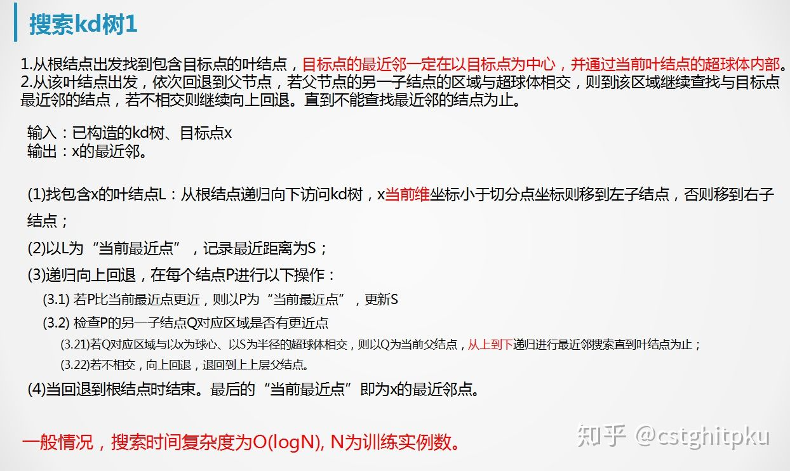
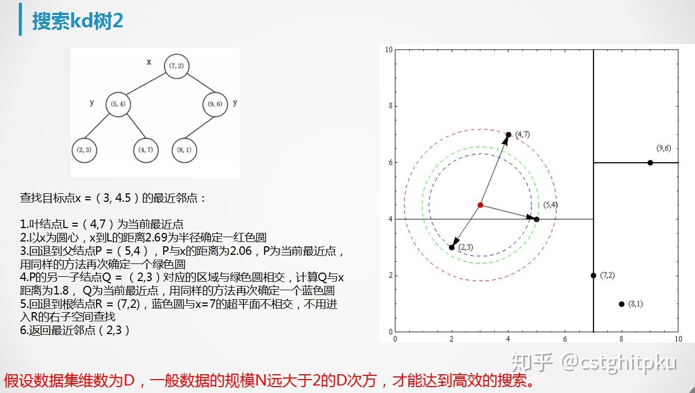
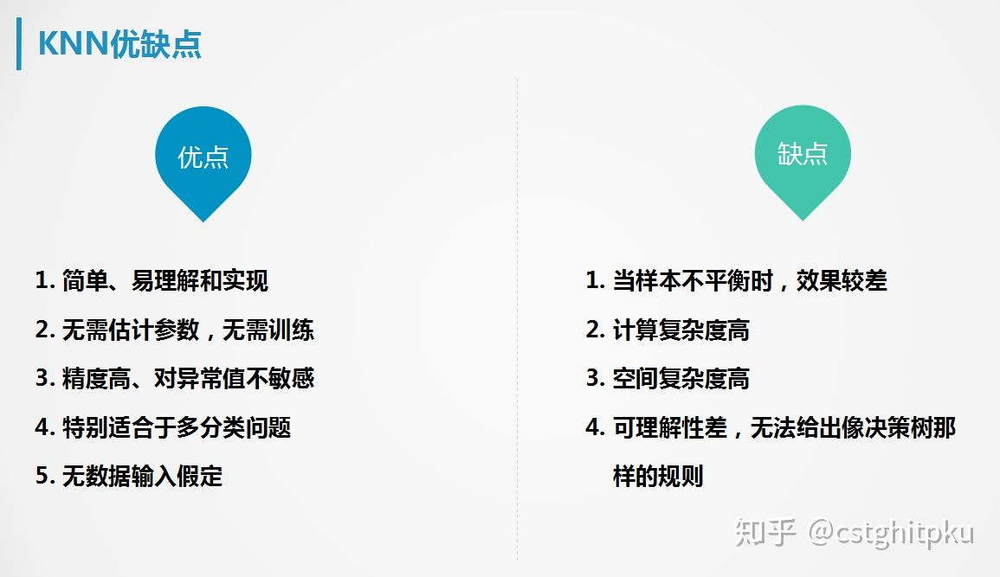

# KNN算法简介
[原文地址](https://zhuanlan.zhihu.com/p/46448216?utm_source=com.tencent.wework&utm_medium=social&utm_oi=980399127217209344)
## 1.基本原理
KNN(K-Nearest Neighbor):采用测量不同特征值之间的距离或相似度的方法进行分类；
### 1.1 基本思想
少数服从多数:如果待测样本的K个最近邻（距离最近或最相似）中的绝大数属于某一类别，那么认为待测样本也为该类； 
### 1.2 决策过程
> 输入：带label的样本集（N-样本数，M-特征维数）| 待测样本 <br/>
> 输出：待测样本的类别 <br/>
1. 将待测样本的特征依次与已有样本进行比较（距离or相似度测量）；
2. 选取与待测样本最相似的K个已有样本；
3. 统计K个已有样本中出现次数最多的类别，并作为待测样本的类别；
## 2.实现方法
### 2.1 线性遍历 O(N)
> 暴力方法
1. 获取样本数据个数
2. 遍历样本数据，依次计算待测样本与已有样本的距离；
3. 按距离对已有样本进行升序排序；
4. 选取topK样本；
5. 计算topK样本中各类别标签出现的次数；
6. 选取次数最多的类别标签作为待测样本的类别；
### 2.2 优化存储结构 O(N)
> 优先级队列 or 大顶堆 ： 不用全局排序
1. 初始化容量为K的优先级队列；
2. 随机从样本集中选取k个样本作为训练元组；
3. 分别计算训练元组中样本与待测样本的距离，并将样本索引和距离存储到队列,队首即为最大距离Dmax的元组；
4. 遍历剩余的样本集；
5. 若待测样本与当前样本距离Dcur > Dmax，说明当前样本距离过大，跳过继续遍历；
6. 若待测样本与当前样本距离Dcur < Dmax，说明当前样本距离较小，将队首样本剔除并插入当前样本；
7. 直至遍历结束，依次输出队列元素即可；
### 2.3 KD树 O(logN)
> 分组快速搜索近邻法
KD树(K-dimension tree):一种对K维空间中的实例点进行存储，并能快速检索的树形数据结构，
构造KD树的过程是不断构建垂直于分割坐标轴的超平面对K维空间进行划分；<br/>
>备注：此K并彼K
#### 2.3.1 节点结构
> partitionDimention-用于分割的维度，取值范围为1,2,…,m <br/>
> partitionValue-用于分割的值v，当数据点在维度partitionDimention上的值小于v时，被分到左节点，否则分到右节点 <br/>
> left-左节点 <br/>
> right-右节点 <br/>
> Max-用于构建该节点的数据集在各个维度上的最大值组成的d维向量 <br/>
> Min-用于构建该节点的数据集在各个维度上的最小值组成的d维向量 <br/>
> value-存储的数据(叶子节点)
```
private class Node{
    //分割的维度
    int partitionDimention;
    //分割的值
    double partitionValue;
    //如果为非叶子节点，该属性为空
    //否则为数据
    double[] value;
    //是否为叶子
    boolean isLeaf=false;
    //左树
    Node left;
    //右树
    Node right;
    //每个维度的最小值
    double[] min;
    //每个维度的最大值
    double[] max;
}
```
#### 2.3.2 创建KD树
```aidl
输入：数据集D
输出：KDTree
a.如果D为空，返回空的KDTree
b.新建节点node
c.如果D只有一个数据或D中数据全部相同
   将node标记为叶子节点
d.否则将node标记为非叶子节点
  取各维度上的最大最小值分别生成Max和Min
  遍历m个维度，找到方差最大的维度作为partitionDimention
  取数据集在partitionDimention维度上排序后的中点作为partitionValue
e.将数据集中在维度partitionDimention上小于partitionValue的划分为D1,
  其他数据点作为D2
  用数据集D1，循环a–e步，生成node的左树
  用数据集D2，循环a–e步，生成node的右树
```
#### 2.3.3 最近邻查找


### 2.4 球树

## 3.关键因素
1. 特征类型需要预先转换为数值类型；
2. 距离对数值大小敏感（归一化）；
3. 选择合理的距离or相似度度量方法；
4. K值确定（交叉验证）；
5. 决策规则（多数表决，加权（距离倒数）表决，平均表决）；

## 4.适用场景
