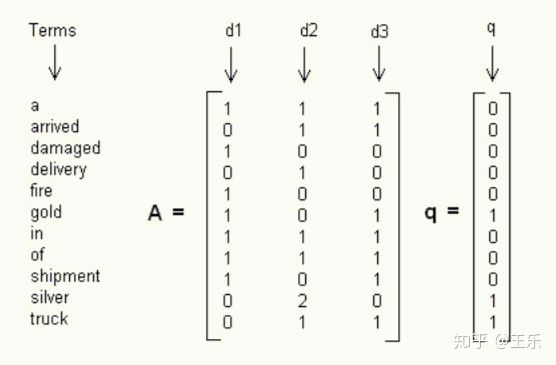
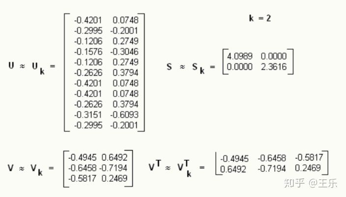
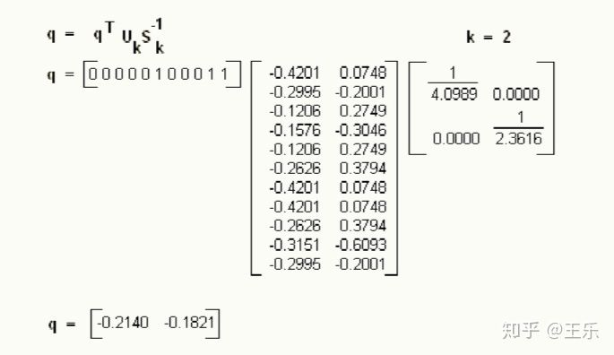
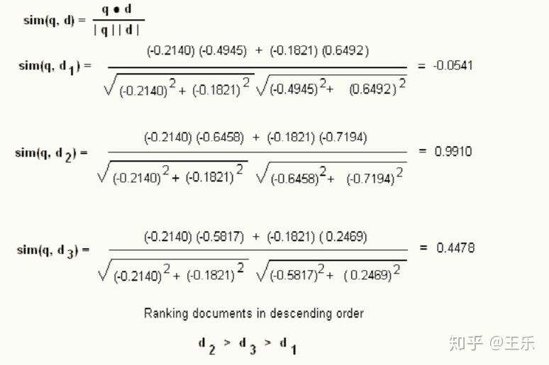
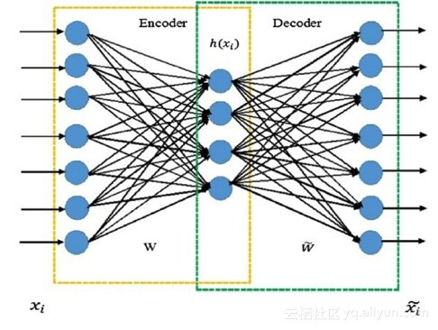

# DSSM模型简介
[Deep Structured Semantic Models](https://zhuanlan.zhihu.com/p/100092308)
> project
  queries and documents into a common low-dimensional space
  where the relevance of a document given a query is readily
  computed as the distance between them.  
> keyword : clickthrough data,cosine similarity,word hashing,supervised
## 1.提出背景
- 关键词匹配
> 提取query关键词进行匹配
- 向量空间模型
>将文档集D中的所有文档和查询都表示成以单词为特征的向量，特征值为单词出现与否或TF-IDF值(计数)，然后使用向量空间模型
(亦即计算查询q的向量和每个文档di的向量之间的相似度)来衡量文档和查询之间的相似度，从而得到和给定查询最相关的文档；
- LSA线性模型（latent semantic models>  
> 解决单词的多义性(polysems)和同义性(synonymys)   
> 同义词会降低检索算法的召回率(Recall)，而多义词的存在会降低检索系统的准确率(Precision)   
> LSA使用SVD来对单词-文档矩阵进行分解。SVD可以看作是从单词-文档矩阵中发现不相关的索引变量(因子)，将原来的数据映射到语义空
间内。在单词-文档矩阵中不相似的两个文档，可能在语义空间内比较相似。  
> 基本检索步骤： 
>1.构建单词-doc矩阵A (m * n)，行为每个单词在所有doc中的特征表示,列为每个待检索doc的单词特征表示； 
>  
>2.基于SVD方法对矩阵A进行分解；
>A = U * S * Vt  
> 
>3.保留影响较大的特征值（维度为k,且k<<c），较小的特征值可以认为为随机噪音； 
> 
>4.基于保留的特征值索引，分别从Q中提取对应的文档语义因子Qc，从D中提取单词语义因子Dc;  
>5.基于query计算伪文档向量  
>  
>6.分别计算query伪文档向量与候选文档的相似度； 
>
- 自编码模型  
>1.压缩 - 表征 - 重建   
>2.无监督  
>3.模型注重重建的精度而不是相关性，实用性不强； 
> 
## 2.主要优化点
- 基于点击数据建立query和doc的联系，并基于带监督的方式进行模型训练;
- 引入深度模型对query和doc的进行表征；
## 3.模型结构
- 输入：原始query词向量
- 输出：低维稠密表示向量
- 技巧：一般而言词汇表有多少种单词，词向量就会有多少维，word hashing能减少输入向量维度

## 4.word hasing实现细节
基础的词袋模型（bag of words）维度过大，multihot维度等于词汇表的维度；
word hashing实质上还是一种词袋模型，只不过对词汇表做了压缩生成新的词汇表，multihot维度等于新的词汇表维度; 
例子：原始词汇表["good","god","goy"]  
1.对每个单词进行N-Gram切分，假如N=3; 
>"good"可以切分为 "#go","goo","ood","od#";  
>"god"可以切分为 "#go","god","od#";  
>"goy"可以切分为 "#go","goy","oy#"; 

2.提取不重复的单词形成新词汇表["#go","goo","god","goy","ood","od#","oy#"],词汇量较大的情况下提取公共前、后缀所形成的新词汇表
肯定是远小于未做切分的旧词汇表的（论文里大约将维度减少了4倍，40k-10k）；
